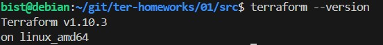
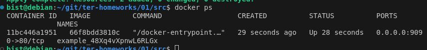

Task 1
1. Запускаю init

2. Секреты разрешено хранить согласно gitignore в personal.auto.tfvars
3. 
4. 

- В блоке resource "docker_image" не хватает имени ресурса
- В блоке resource "docker_container" "1nginx" имя должно начинаться с буквы.
- в name  = "example_${random_password.random_string_FAKE.resulT}" не верно указаны параметры _FAKE.resulT
5. Исправленный код
 

 Вывод команды docker ps
 

 6. ключ auto-approve опасен тем, что нет предпросмотра изменений и возможны потери данных. В моем случае контейнер удалился, но новый не создался из-за конфликта портов. После повторного запуска создался новый.
 

 

 7.Содержимое tfstate после terraform destroy
 

 8. docker image не удалился потому что у него было указано  "keep_locally = true"
 В документации написано - keep_locally (Boolean) If true, then the Docker image won't be deleted on destroy operation. If this is false, it will delete the image from the docker local storage on destroy operation.

 Task 2
 Вывод переменых
 

 Конфигурация tfstate

 terraform {
  required_providers {
    docker = {
      source  = "kreuzwerker/docker"
      version = "~> 3.0.1"
    }
  }
  required_version = ">=0.13"
}
provider "docker" {
  host = "ssh://bist@89.169.165.160"
  ssh_opts = ["-o", "StrictHostKeyChecking=no", "-o", "UserKnownHostsFile=/dev/null"]
}
resource "random_password" "root_password" {
  length      = 16
  special     = false
  min_upper   = 1
  min_lower   = 1
  min_numeric = 1
}
resource "random_password" "user_password" {
  length      = 16
  special     = false
  min_upper   = 1
  min_lower   = 1
  min_numeric = 1
}

resource "docker_image" "mysql-vm" {
  name         = "mysql:8"
  
 }

resource "docker_container" "mysql-vm" {
  image = docker_image.mysql-vm.image_id
  name  = "mysql-vm"
  env = [
    "MYSQL_ROOT_PASSWORD=example_${random_password.root_password.result}",
    "MYSQL_DATABASE=wordpress",
    "MYSQL_USER=wordpress",
    "MYSQL_PASSWORD=example_${random_password.user_password.result}"
  ]

  ports {
    internal = 3306
    external = 3306
  }
 }

